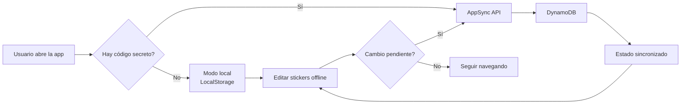

# Figuritas Mundial

**Figuritas Mundial** es una PWA mobile-first para llevar un control rápido de las figuritas faltantes del Mundial.

Está pensada para uso personal, en el celular, con un flujo simple:

1. Importar una lista de faltantes.
2. Buscar por código o país.
3. Marcar figuritas como conseguidas.
4. Ver el resumen y compartir faltantes.
5. Sincronizar el estado entre dispositivos con AppSync, usando un código secreto compartido.

## Importante

Este es un proyecto de juguete, hecho para divertirse y experimentar con una PWA liviana.
No está pensado como una aplicación seria de producción, ni como una herramienta oficial del álbum.

## Stack

- Vite
- React
- TypeScript
- Tailwind CSS
- `vite-plugin-pwa`
- AWS AppSync + DynamoDB para sincronización opcional entre dispositivos

## Versionado

La versión visible en la pantalla principal sale de `package.json` y se muestra en el header de la vista de faltantes.
Cada cambio relevante debería venir acompañado por un bump de versión para que la app lo refleje.

## Sincronización

La sincronización es opcional.

- Si no cargás un código, la app funciona solo con el almacenamiento local del dispositivo.
- Si cargás el mismo código secreto en dos dispositivos, ambos comparten el mismo estado a través de AWS AppSync.
- El endpoint de sincronización se puede configurar con `VITE_APPSYNC_URL` si hace falta apuntar a otra API.

## Arquitectura

La parte de backend e infraestructura vive en `infra/` y está separada del frontend.

- **Frontend**: Vite + React + TypeScript + PWA.
- **Backend**: AWS AppSync como API GraphQL y DynamoDB como almacenamiento del estado.
- **Acceso**: no usa Cognito por ahora. La API se protege con un código secreto compartido que la app manda como token.
- **Modo de trabajo**: el dispositivo sigue guardando una copia local para funcionar offline, y sincroniza cuando el código está configurado.

El flujo es simple:

1. La app lee el estado local al abrir.
2. Si hay un código guardado, consulta AppSync.
3. Si el estado local cambió, lo sube al backend.
4. Si otro dispositivo cambió algo, el siguiente sync trae ese estado.



Más abajo está el CDK app si querés tocar la infraestructura:

- `infra/README.md`
- `infra/lib/figuritas-sync-stack.ts`
- `infra/lambda/authorizer.ts`
- `infra/lambda/data-handler.ts`

## Roadmap

Esto es opcional y solo aplica si el proyecto empieza a tener más gente interesada.
Si no, el plan es dejarlo tal cual está.

- Mantener el modo actual: un código compartido, PWA local-first y sync opcional.
- Preparar el backend para múltiples grupos o tenants, sin meter Cognito todavía.
- Hacer que el código secreto apunte a un `tenantId` real en la infraestructura.
- Agregar una forma simple de crear o desactivar códigos si hace falta.
- Evaluar mejoras de sync en vivo solo si el polling deja de alcanzar.

La idea es no complicar el proyecto antes de tiempo. Si nadie más lo usa, se queda en su forma simple actual.

## Desarrollo local

```bash
npm install
npm run dev
```

## Build

```bash
npm run build
```

## Deploy

La app está preparada para deploy estático en AWS Amplify usando el branch `master`.
